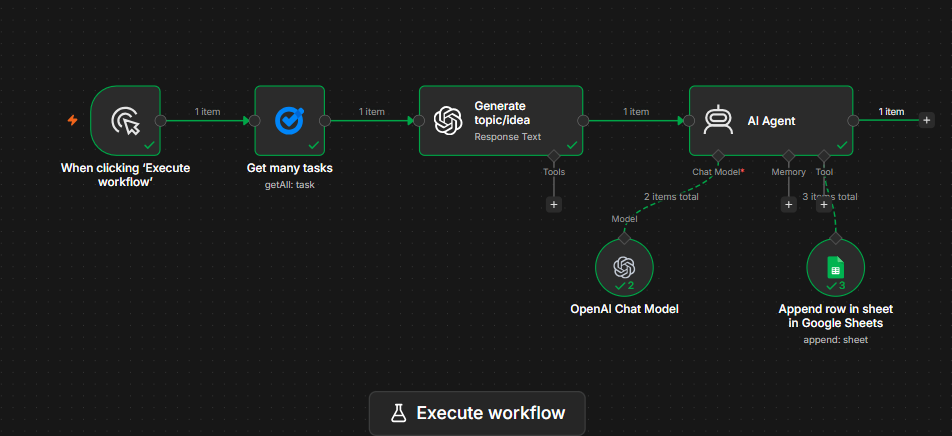

# Social Media Automation Post Generator with n8n

An n8n automation project that uses AI to generate LinkedIn posts from
AI news research and save the final content in Google Sheets.

## Workflow

**AI News Research → Google Tasks → n8n → OpenAI → AI Agent → Google
Sheets**

## How It Works

1.  Research recent AI news and save the research in Google Tasks.
2.  n8n retrieves the research using the Google Tasks node.
3.  OpenAI generates 3 content ideas with topics and references.
4.  The AI Agent creates concise LinkedIn posts with hooks and hashtags.
5.  Google Sheets stores the **Topic, Reference, and Post**.

## Tools Used

-   n8n
-   OpenAI
-   Google Tasks
-   Google Sheets
-   AI Agent

## Result

Automates repetitive LinkedIn content creation and keeps generated posts
organized in Google Sheets.

## Future Improvements

-   Automatic web research
-   Scheduled workflow execution
-   Source verification
-   Human approval before publishing
